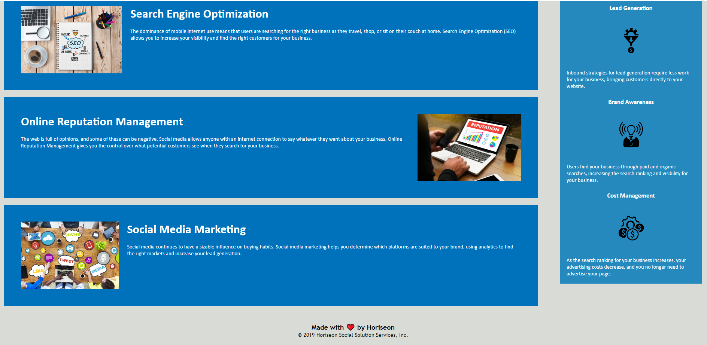

# Unit-1-Challenge Refactoring the Horiseon Webpage
## Description

For this challenge, I took the started code provided and refactored it in several ways. The goal was to clean up the code, particularly regarding the .css file as well as to improve the accessibility features of the application. 

## Installation

N/A

## Usage

Users can now explore the Horiseon landing page while also having alt text on images for those who use screen readers. The "seo" in Horiseon's header at the top of the page is now slightly darker to make it apparent to users that the colors are different. Spacing has been slightly increased in the Benefits aside to allow for easier reading. Users inspecting the webpage's elements will also find cleaner styling rules so there are fewer redundant lines of code. 

## Credits

Horiseon Landing Page starter code courtesy of the ASU-VIRT-FSF-PT-04-2023-U-LOLC GitLab repository.

## License

N/A